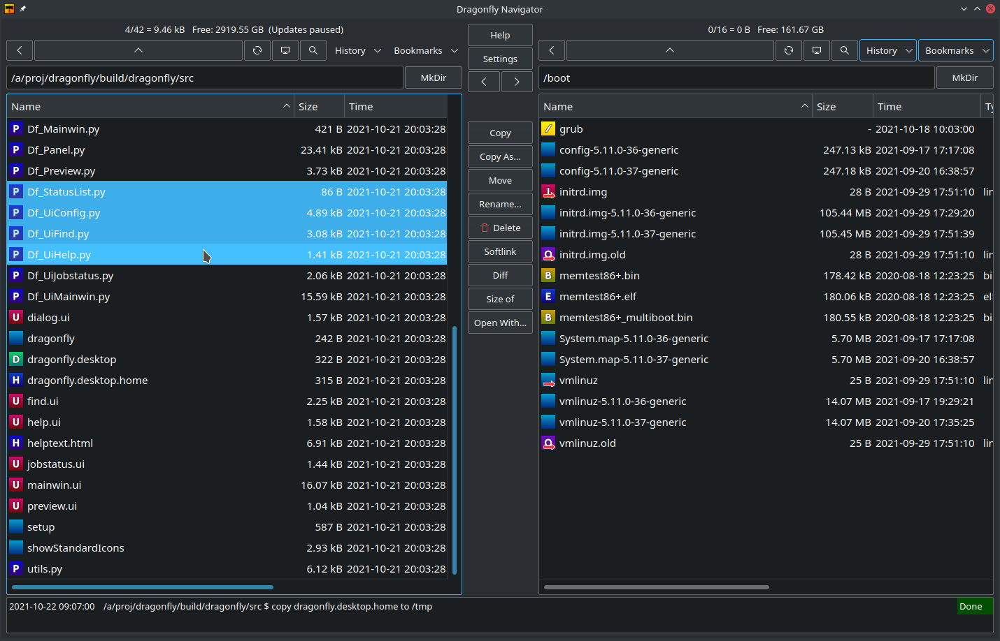
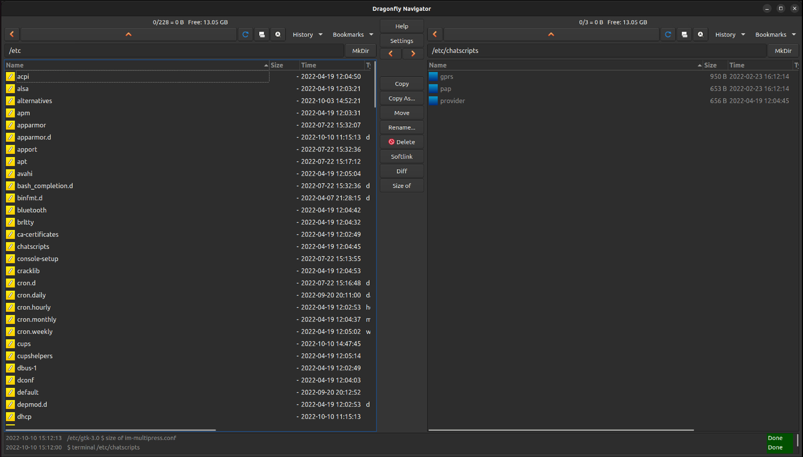

# Dragonfly Navigator
A simple and efficient dual pane file manager for Linux.

On KDE:


On Gnome:


Notable features:

- Fast folder navigation
- Predictable file and folder operations without relying on drag-n-drop or copy/paste.
- Asynchronous file operations with queue management
- Quick preview (Alt key + mouse hover) for text and images
- AVIF, HEIF, JPG etc. image preview and icons

## Installing and running on Ubuntu / Debian
Download .deb file from the [github release page](https://github.com/suncore/dflynav/releases). Then install like this:
```
$ sudo dpkg -i dragonfly_xxx.deb
$ sudo apt install -f
```
Run:
```
$ dragonfly 
```
Dragonfly Navigator should now also be possible to find in the desktop application menu.

## Installing and running on other distributions than Ubuntu / Debian
Download the .tar.gz package from the [github release page](https://github.com/suncore/dflynav/releases). Then install like this:

```
Install the following dependencies: python3-pil adwaita-qt python3-pyqt6
$ tar xzf dragonfly_xxx.tar.gz
$ cd dragonfly
$ ./setup 
```

Run:
```
$ dragonfly 
```
If dragonfly can not be found you may need to log out and in again, otherwise add ~/.local/bin to your path. Dragonfly Navigator should now also be possible to find in the desktop application menu.

If you have problems, contact me at henrik@harmsen.se. 


## Building and running from sources 
These instructions are for ubuntu 24.10 or later.
1. Clone from github
```
$ git clone https://github.com/suncore/dflynav.git
```
2. Install prerequisites
```
$ sudo apt install pyqt6-dev-tools qtcreator libkf6widgetsaddons-dev libkf6xmlgui-dev libkf6textwidgets-dev libkf6kio-dev build-essential libkf6config-dev libkdecorations2-dev extra-cmake-modules libkf6guiaddons-dev libkf6configwidgets-dev libkf6windowsystem-dev libkf6coreaddons-dev gettext libgtkmm-3.0-dev python3-pil adwaita-qt python3-pyqt6 extra-cmake-modules kdevelop qt6-base-dev qtbase5-private-dev qt6-tools-dev libgcrypt20-dev qt6-l10n-tools

```
3. Building:
```
$ cd dragonfly/src
$ ./build
```
4. Run:
```
$ ./dragonfly
```

Use qtcreator to edit the GUI .ui files.

